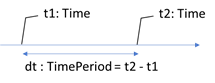

# Implementacja struktur `Time` i `TimePeriod` (C#) 

* Autorem tego zadania jest Krzysztof Molenda - ćwiczenie zostało zamieszczone na moim GitHubie w celu nabicia aktywności (ang. Contributions) na profilu i przy okazji rozwiązania problemu.

Zagadnienia:
* Projektowanie typu danych
* Typ strukturalny (`struct`)
* Implementacja interfejsów
* Przeciążanie operatorów
* Praca na wielu plikach
* Testowanie funkcjonalności
* Properties i Auto-Properties
* Zapewnianie niezmienności (immutability) zmiennych

UWAGA: Zadanie ma charakter ćwiczebny. W bibliotekach C# dostępne są gotowe struktury / klasy realizujące (pradopodobnie lepiej) przedstawione założenia (`DateTime`, `DateTimeOffset`, `TimeSpan`). Jednak realizacja tego zadania pozwala lepiej zrozumieć ich działanie.

## Problem, cel

Zaprogramuj, korzystając z notatek do wykładów, wzajemnie powiązane ze sobą struktury `Time` i `TimePeriod`, spełniające następujące wymagania:

### Stuktura `Time`

* Zmienna typu `Time` opisuje punkt w czasie, w przedziale `00:00:00 ... 23:59:59` (weź pod uwagę arytmetykę modulo w godzinach `%24` oraz minutach i sekundach `%60` - wtedy, kiedy to będzie sensowne i wymagane).

* Wewnętrzną reprezentacją czasu są pola typu `byte` : `Hours`, `Minutes`, `Seconds` - zrealizuj je jako properties.

* Zapewnij niezmienność (ang. immutable) tworzonych zmiennych typu `Time`.

* Dostarcz różne warianty konstrukcji (między innymi dla trzech parametrów: `godzina, minuta, sekunda`, dla dwóch parametrów: `godzina, minuta`, dla jednego parametru: `godzina`. dla parametru typu `string` o postaci `hh:mm:ss` i ewentualnie innych według uznania). Zadbaj o poprawną konstrukcję zmiennych, zgłaszając odpowiedni wyjątek w sytuacji błędnych danych.

* Zaimplementuj standardową reprezentację tekstową czasu (w postaci `hh:mm:ss`) - przeciąż metodę `ToString()`.

* Zaimplementuj interfejsy `IEquatable<Time>` oraz `IComparable<Time>` dzięki którym zdefiniujesz natualny porządek w zbiorze "punktów czasowych" przeciąż opratory relacyjne (`==`, `!=`, `<`, `<=`, `>`, `>=`).

* Zapewnij działania arytmetyczne na czasie (modulo 24 godziny) - plus, minus np. metody `Time Plus(TimePeriod)`, `static Time Plus(Time, TimePeriod)`, przeciążenie operatora `+`.

### Struktura `TimePeriod`

* Zmienna typu `TimePeriod` reprezentuje długość odcinka w czasie (odległość między dwoma punktami czasowymi, czas trwania).

* Przyjmij wewnętrzną realizację czasu trwania jako liczbę sekund (typ `long`).

* Zapewnij "zewnętrzną reprezentację" w postaci `h:m:s` - uwaga: wartość `12:25:23` typu `TimePeriod` oznacza upływ czasu równy 12 godzin, 25 minut i 23 sekund, zaś ten sam zapis w rozumieniu `Time` oznacza punkt na osi czasu: godzinę dwunastą dwadzieścia pięc i 23 sekundy. Uwaga zmienna typu `TimePeriod` o wartośći `29:58:12` ma sens tzn. oznacza ona odcinek czasowy o długości 29 godzin, 58 minut i 23 sekund, zaś w typie `Time` nie ma sensu.

* Zapewnij niezmienność (ang. immutable) tworzonych zmiennych typu `TimePeriod`.

* Dostarcz różne warianty konstrukcji (m. in. dla trzech parametrów: liczba godzin, liczba minut, liczba sekund; dla dwóch parametrów: liczba godzin, liczba minut; dla jednego parametru liczba sekund; dla dwóch parametrów typu `Time` obliczając różnicę punktów czasowych, dla parametru typu `string` o postaci `h:mm:ss` i ewentualnie innych, wg uznania), zadbaj o poprawną konstrukcję zmiennych, zgłaszając odpowiedni wyjątek w sytuacji błędnych danych.

* Zaimplementuj standardową reprezentację tekstową upływu czasu (w postaci `h:mm:ss`) - przeciąż metodę `ToString()`, dopuszczalny jest zapis `129:58:12`.

* Zaimplementuj interfejsy `IEquatable<TimePeriod>` oraz `IComparable<TimePeriod>`, przeciąż operatory relacyjne (`==`, `!=`, `<`, `<=`, `>`, `>=`).

* Zapewnij działania arytmetyczne na odcinkach czasowych - plus, minus, np. metody `TimePeriod Plus(TimePeriod)`, `static TimePeriod Plus(TimePeriod, TimePeriod)`, przeciążenie operatora `+`, oraz inne - wg uznania.

### Do struktury `Time` i `TimePeriod`

* Przetestuj poprawność zaprojektowany struktur tworząc odpowiednie testy jednostkowe.

### Zadanie dodatkowe

* Zmodyfikuj działanie struktury tak, aby możliwe było operowanie na milisekundach, czyli tysięcznych częściach sekundy. Taka realizacja może przydać się przy tworzeniu typu stoper, gdzie pożądana jest jest większa dokładność niż na poziomie 1 sekundy.